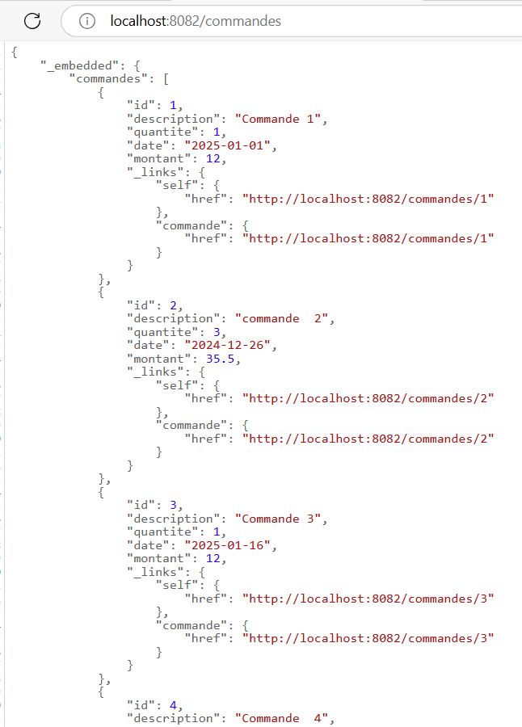

# Devoir_JEE_Microservice

#### Team de développement

LAAZIZ Anass
SALHAOUI Hamza
5IIR7

#### Objectif du projet

Le projet consiste à développer un système basé sur une architecture microservices avec Spring Boot et Spring Cloud. 
L'objectif est de créer deux versions du **microservice-commandes** et d'interagir avec un **microservice-produit**.

### Etude  de cas 1 : Microservice Commandes

L'objectif de cette première étude de cas est de :
1. **Créer un microservice-commandes**  ermettant de gérer les opérations CRUD .
2. **Configurer le microservice-commandes avec Spring Cloud** et **GitHub**.
3. Ajouter une propriété personnalisée mes-config-ms.commandes-last pour configurer dynamiquement
   le nombre de jours des commandes récentes, **modifiable à chaud** via Spring Actuator.
4. Implémenter la **supervision de la santé**.

### Etude de cas 2 : Microservice Commandes et Microservice Produits

L'objectif de cette deuxième étude de cas est de :
1. **Étendre le microservice-commandes** pour inclure une colonne `id_produit` dans la table `COMMANDE`.
2. **Enregistrer les microservices-commandes et microservice-produit auprès d'Eureka**.
3. **Implémenter une API Gateway**.
4. **Simuler un Timeout**.

#### Pour exécuter le projet :

1. Clonez ce dépôt sur votre machine locale :
git clone https://github.com/LAAZIZAnass/Devoir_JEE_Microservices.git
cd Devoir_JEE_Microservices
2. Exécutez les services dans l'ordre suivant 
 **discovery-service**
 **config-service**
 **produit-service**
 **commande-service**
 **gateway-service**

### Pour tester l'application avec Postman

Envoyez des requêtes GET/POST/PUT/DELETE aux API via l'API Gateway 
pour interagir avec les microservices Commandes et Produits.

### Screenshots
##  Etude  de cas 1:

 1. Page de commandes : localhost:8082/commandes

